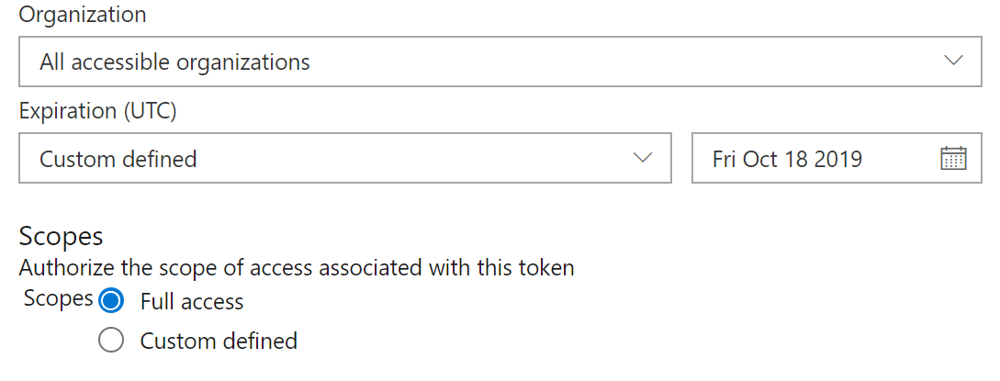

### Modified This Theme By Xun

### Introduce

This theme is designed for myself.

- Z Light: a whiteboard-like theme
- A Less Dark: a ocean-like theme
- A Dark: a blackboard-like theme

Z, A added before because the names can be closer.

> Design Thought:
> As vscode-color can be overrided(Json Multi-Same keys) by what comes later, I use a theme as base, and others can just rewrite needed things.\
> Example: naive and whole_less.json (dark)

## TODO:

change all `white`, `black` like color into one-string.

Method: Run a script locally, which generate a real `theme.json` from a naive `config.json`.

Config.json
```json
"background":"black",
"forground" : "white"
```
Theme.json
```json
"scrollbar.background":"#212121",
"menu.background" : "#212121"
```

Refer: https://code.visualstudio.com/api/references/theme-color

### Some Paths for Manaully add theme

- Manaully move to $CODE_RELEASE$/resources/app/extensions
    - $CODE_RELEASE$ = /usr/share/code/

- backup method
    - sudo rm -rf /usr/share/code/resources/app/extensions/theme-xun/
    - sudo cp -r ~/Desktop/theme-xun /usr/share/code/resources/app/extensions/


### Backup Info

- view [Devloper](https://marketplace.visualstudio.com/manage) to see my extensions

- Regen a token in [Token](https://dev.azure.com/username/_usersSettings/tokens)
Shown like 

- Update My theme using cmd:
```
npm i -g vsce
vsce login insight # with token of azure input
vsce publish patch
```